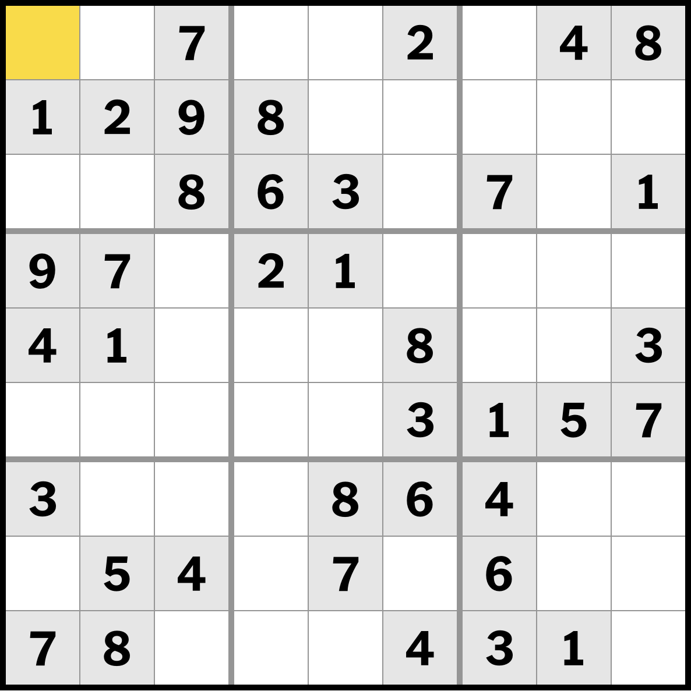

# Sudoku Solver with OCR

This project is a Sudoku solver application built using Streamlit and OCR technology. It allows users to upload Sudoku puzzle images, extract the grid using advanced image processing and OCR, and solve the puzzle interactively.

## Features
- Upload a Sudoku puzzle image
- Advanced image preprocessing:
  - Grayscale conversion
  - Gaussian blur for noise reduction
  - Adaptive thresholding
  - Grid line removal for improved OCR accuracy
- Automatic grid extraction using Tesseract OCR
- Interactive manual correction interface for OCR results
- Efficient puzzle solving using backtracking algorithm
- Real-time visual feedback with color-coded cells
- Comprehensive error handling and validation
- Built with Streamlit for an intuitive user interface

 

## Technical Implementation

### OCR Processing Pipeline
1. Image Preprocessing
   - Converts image to grayscale
   - Applies Gaussian blur for noise reduction
   - Uses adaptive thresholding for binary conversion
   - Removes horizontal and vertical grid lines using morphological operations

2. Grid Extraction
   - Divides preprocessed image into 81 cells
   - Applies padding and resizing for optimal OCR
   - Uses Tesseract OCR with custom configuration for digit recognition
   - Supports both Tesseract and EasyOCR implementations

3. Solving Algorithm
   - Implements an efficient backtracking algorithm
   - Validates numbers against Sudoku rules:
     - Row uniqueness
     - Column uniqueness
     - 3x3 subgrid uniqueness
   - Provides real-time solution feedback

## Installation Instructions

Follow these steps to set up the Sudoku Solver on your local machine.

### Prerequisites
1. **Python**: Ensure you have Python 3.9+ installed
2. **Tesseract OCR**: Required for digit recognition

### 1. Install Python and Required Libraries

1. Clone the repository:
```bash
git clone https://github.com/broepke/sudoku-solver
cd sudoku-solver
```

2. Create and activate virtual environment:
```bash
python -m venv venv
source venv/bin/activate
pip install --upgrade pip
pip install -r requirements.txt --upgrade
```

### 2. Install Tesseract OCR
```bash
brew install tesseract
```

## Optional: Docker Deployment

A Dockerfile is provided for containerized deployment with all dependencies pre-configured:

```bash
docker build -t sudoku-solver .
docker run -p 8501:8501 sudoku-solver
```

## Optional: Streamlit Community Cloud

The application is configured for Streamlit Community Cloud deployment. The `packages.txt` file includes necessary Linux dependencies for OCR support.

## Running the Application

1. Start the Streamlit app:
```bash
streamlit run sudoku_solver.py
```

2. Access the application at `http://localhost:8501`

## Usage Guide

1. **Upload Image**
   - Upload a clear image of a Sudoku puzzle
   - Supported formats: PNG, JPG, JPEG

2. **Grid Extraction**
   - The app automatically preprocesses the image
   - Displays the preprocessed result for verification
   - Shows extracted grid with recognized numbers

3. **Manual Correction**
   - Review the extracted numbers
   - Use the number input fields to correct any misrecognized digits
   - Empty cells should be left as 0

4. **Solve Puzzle**
   - Click "Solve" to find the solution
   - Solution is displayed with color-coded cells
   - Blue cells indicate original numbers
   - White cells show the solved values

## Logging and Diagnostics

The application includes comprehensive logging:
- OCR engine versions
- Python and OpenCV versions
- Processing steps and errors

This helps in troubleshooting and ensures optimal performance across different environments.
